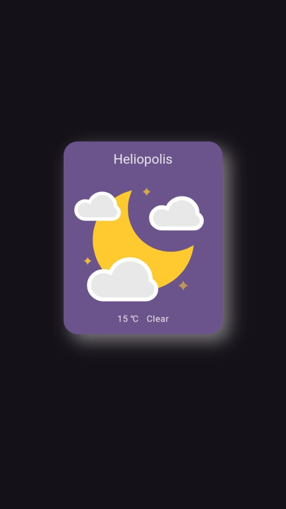

# SkyStatus App


SkyStatus is a Flutter application that allows users to view real-time weather updates based on their current location. The app leverages the OpenWeatherMap API to fetch weather data using the device's latitude and longitude. With smooth animations and responsive design, SkyStatus provides a seamless user experience.

## Features

- **Real-Time Weather Updates**: Fetch and display current weather conditions based on the user's location.
- **Animated Weather Status**: Visualize weather conditions with engaging animations using _Lottie_.
- **Day/Night Theme and Animations**: Automatically switches themes and animations based on the current time of day, offering a more immersive experience.
- **Loading Animations**: Display visually appealing loading states with different images: one when the data is being fetched and another when the user drags to refresh.
- **Responsive Design**: Adapt seamlessly to various screen sizes with the help of Flutter ScreenUtil.
- **MVC Architecture**: Organized into Model-View-Controller for clear separation of concerns, maintainability, and scalability.

## Dependencies

- `http: ^1.2.2` to fetch weather data from OpenWeatherMap.
- `geolocator: ^13.0.2` to fetch the user's latitude and longitude.
- `lottie: ^3.3.0` for displaying engaging animations based on the weather status.
- `fluttertoast: ^8.2.10` for showing error messages as toast notifications without context.
- `flutter_screenutil: ^5.9.3` for scaling and adapting widgets for responsive design.
- `flutter_dotenv: ^5.2.1` for managing API keys securely with environment variables.
- `redacted: ^1.0.13` for generating placeholders that imitate the appearance of final widgets during loading states.
- `custom_refresh_indicator: ^4.0.1` to implement refresh functionality

## .env File

SkyStatus uses a `.env` file located in the lib directory to securely store the OpenWeatherMap API key. Below is an example of its content:

```

apiKey = YOU_API_KEY

```

Ensure the `.env` file is included in your project to enable API requests.

## Screenshots

<p float="left">
  
  
</p>

_Day/Night Theme_: Automatically adapts to the time of day with corresponding themes and animations.

<p float="left">
  
  
</p>

_Loading and Refresh Animations_: Displays different images during the loading state and when the user drags to refresh.

## API Reference

SkyStatus integrates the OpenWeatherMap API. For documentation, visit [OpenWeatherMap](https://openweathermap.org/).
